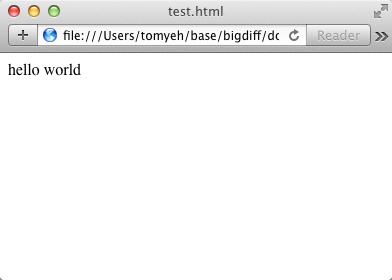
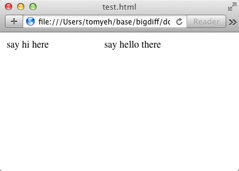

# domout


# Features

## Implemented

N/A

## Planned

Log "hello world" to a web page shown live in a browser (default to the `<body>` tag)

```javascript
var domout = require('domout')
domout.log('hello world')
```



Log multiple lines in the append mode (default)

```javascript
var domout = require('domout')
domout.log('first line')
domout.log('second line')
domout.log('third line')
```


Output to different dom components

Assuming in a browser, a HTML page has already been loaded with the following contents

```html
<table width="100%">
	<tr>
		<td id="left"></td>
		<td id="right"></td>
	</tr>
</table>
```

Then, we can output to the cell marked as 'left' and 'right' respectively.

```javascript
var domout = require('domout')

var left = domout.$('#left')
var right = domout.$('#right')

left.log('say hi here')
right.log('say hello there')
```



Use colors via Chalk

```javascript
var domout = require('domout'),
	chalk = require('chalk')
	
domout.log(chalk.red('red'))
domout.log(chalk.green('green'))
```


Redirect `console` to `domout`

```javascript
var domout = require('domout')
console = domout.pipeFrom(console)

// all existing console.log now go to the browser
console.log('hello world')
```

Given a set of async tasks running in parallel, log to a different `DIV` per task

```javascript
var async = require('async'),
    domout = require('domout')


domout.load('<div id="1"></div><div id="2"></div><div id="3"></div><div id="result"></div>')

// assume each job object has an id=1, 2, 3 respectively
var jobs = [job1, job2, job3]

async.map(jobs,

    function(job, callback) {

        var log = domout.$(job.id).log

        log('start')

        // doing the job
        log('status 25%')

        // doing the job
        log('status 50%')

        // doing the job
        log('status 75%')

        // doing the job
        log('done')

        callback(null, 'done')
    },
    function(err, result) {
        if (err) {
            domout.$('result').error(result)
        } else {
            domout.$('result').log(result)
        }
    }
)
```